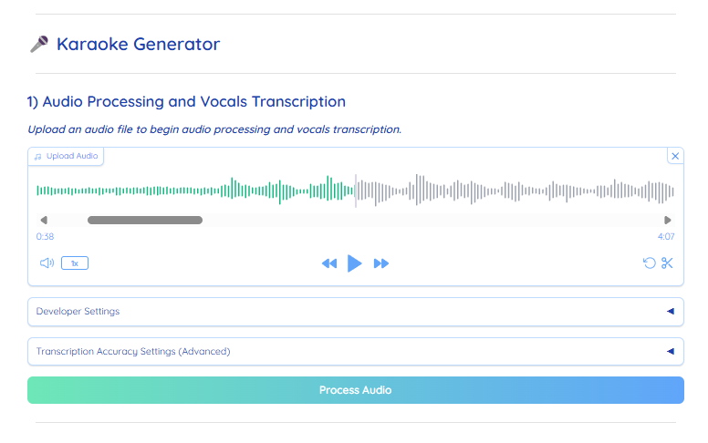
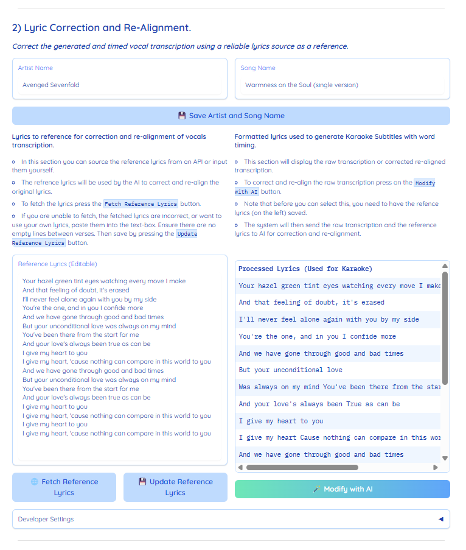
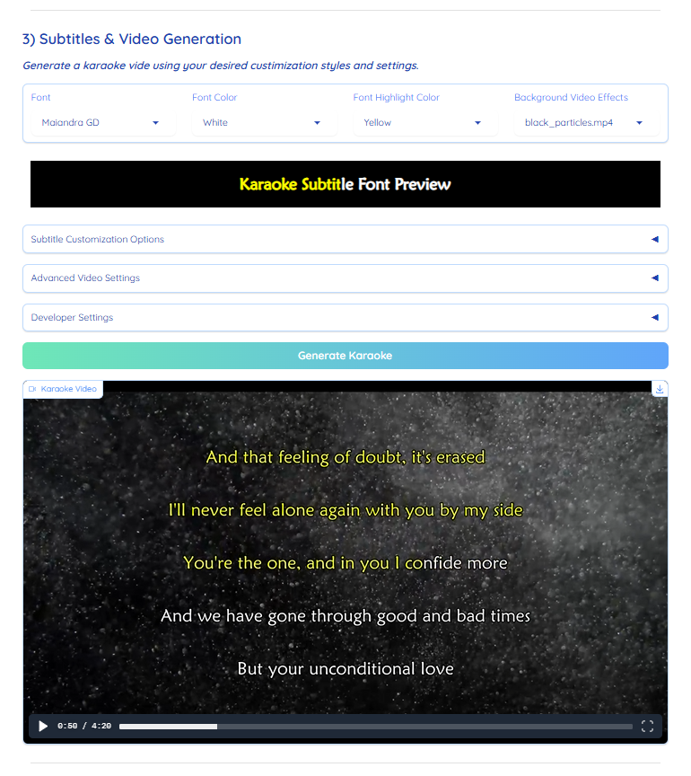

# AI Karaoke Studio: Create Karaoke Videos 10x Faster!

<p align="center"> 
 
 

  
</p>

## Overview
**AI Karaoke Video Creator** is a Gradio-based application that **dramatically reduces** the time needed to transform a standard song into a fully produced karaoke video.
Typical manual workflows can take **4-8 hours** per song. With AI-driven automation—Demucs (Facebook AI) for stem separation, OpenAI Whisper for transcription, AcoustID + Genius for metadata/lyrics, and Gemini AI for correction—this app brings the process down to **5-15 minutes**.

**Key Highlights:**
- **Stem Separation & Audio Processing**: Automatic creation of an instrumental track from your uploaded audio.
- **AI Transcription**: Converts vocals to timed lyrics using OpenAI Whisper.
- **Lyric Alignment & Correction**: Fetches official lyrics from Genius or user input, then refines alignment via Gemini AI.
- **Subtitle & Video Generation**: Highly customizable karaoke video output with dynamic subtitle styles and optional background effects.
- **Caching for Efficiency**: Generates a unique hash-based cache folder for each audio track, speeding up reprocessing tasks.  

<br>

---

## Demo & Example Outputs

- **Demo Walkthrough:** **[Youtube Walkthrough Link](https://www.youtube.com/watch?v=XA5xXCvO7DY)**   
- **Sample Video 1:** **[[ Karaoke Version ] I Still Remember - Blackmore's Night](https://www.youtube.com/watch?v=phZbiLP0DH0)**  
- **Sample Video 2:** **[[ Karaoke Version ] The Boy Who Wouldn't Hoe Corn - Alison Krauss & Union Station](https://www.youtube.com/watch?v=jYw0TCsZ-QM)**  
- **Sample Video 3:** **[[ Karaoke Version ] Dear God - Avenged Sevenfold ](https://www.youtube.com/watch?v=TE46w0JIPuI)**  

> _**Check out the videos to get a sense of the final product quality!**_  

<div align="center">
  <a href="https://www.youtube.com/watch?v=XA5xXCvO7DY">
    
  </a>
  <a href="https://www.youtube.com/watch?v=phZbiLP0DH0">
    
  </a>
</div>
<br>
<div align="center">
  <a href="https://www.youtube.com/watch?v=jYw0TCsZ-QM">
    
  </a>
  <a href="https://www.youtube.com/watch?v=TE46w0JIPuI">
    
  </a>
</div>

<br>

---

## Table of Contents

1. [Overview](#overview)  
2. [Demo & Example Outputs](#demo--example-outputs)  
3. [Features](#features)  
4. [System Architecture](#system-architecture)  
5. [Installation & Setup](#installation--setup)  
    - [Step 1: Install Conda](#step-1-install-conda)  
    - [Step 2: Set Up API Keys](#step-2-set-up-api-keys)  
    - [Step 3: Install FFmpeg and Chromaprint](#step-3-install-ffmpeg-and-chromaprint)  
    - [Optional GPU Acceleration (NVIDIA Only)](#optional-gpu-acceleration-nvidia-only)  
    - [Step 4: Install Dependencies](#step-4-install-dependencies)  
    - [Step 5: Running the App](#step-5-running-the-app)  
6. [Installation & Setup with Docker](#installation--setup-with-docker)  
    - [Step 1: Install Docker Desktop](#step-1-install-docker-desktop)  
    - [Step 2: Build docker image](#step-2-build-docker-image)  
    - [Step 3: Set Up API Keys](#step-3-set-up-api-keys)  
    - [Step 4: Running the App](#step-4-running-the-app)  
7. [How to Use](#how-to-use)  
    - [Step 1: Audio Processing & Transcription](#step-1-audio-processing--transcription)  
    - [Step 2: Lyric Correction & Alignment](#step-2-lyric-correction--alignment)  
    - [Step 3: Karaoke Video Generation](#step-3-karaoke-video-generation)  
8. [Customization](#customization)  
9. [Caching Mechanism](#caching-mechanism)  
10. [Benefits](#benefits)  
11. [License](#license)  

<br>

---

## Features

1. Audio Processing & Transcription
    - **Demucs (Facebook AI)** for automatic stem separation (vocals, bass, drums, etc.).
    - **Merges** stems (except vocals) to produce a karaoke-style instrumental.
    - **OpenAI Whisper** for vocal transcription with word-level timestamps.

2. Metadata & Lyrics Retrieval
    - **AcoustID** to identify audio fingerprint and retrieve song metadata (artist, title).
    - **Genius API** to auto-fetch official song lyrics.
    - **Manual Input option** for lyrics when metadata is incomplete or for custom songs.

3. Lyric Correction & Alignment
    - **Gemini AI** to align and correct transcription using official or user-provided lyrics.
    - Handles spelling errors, missing words, verse alignment, etc.

4. Karaoke Video Generation
    - Generate `.ass` subtitle files with user-defined font, color, highlights, shadows, and outlines.
    - Seamlessly **loop background video effects** for a visually appealing background.
    - Final output as a single high-quality karaoke video (customizable resolution, bitrate, FPS).

5. Caching for Fast Iterations
    - Creates a unique hash-based directory for each audio file.
    - Allows partial reprocessing only for sections you choose to override (metadata fetch, AI transcription, etc.).

<br>

---

## System Architecture

Below is a high-level overview of the application’s workflow:

1. **User Uploads an Audio File**
2. **AcoustID**: Generate audio fingerprint → Retrieve song metadata
3. **Demucs**: Separate audio stems (vocals, instruments) → Merge instrument stems to create instrumental
4. **Whisper**: Transcribe vocals (with timestamps)
5. **Genius / Manual Input**: Fetch or provide reference lyrics
6. **Gemini AI**: Align & correct transcribed lyrics with reference lyrics
7. **Subtitle & Video Generation**: Create .ass subtitles → Loop selected video effect → Render final karaoke video

All of this is orchestrated within a **Gradio** interface. Once you launch `app.py`, it provides a local URL that you can open in your browser to interact with these steps visually.

<br>

---

## Installation & Setup


### Step 1: Install Conda

<details open> <summary><strong>Windows</strong></summary>

1. Download and install [Anaconda](https://www.anaconda.com/) or [Miniconda](https://docs.conda.io/en/latest/miniconda.html).
2. During installation, ensure `conda` is added to your system `PATH`.  
    - Example: `C:\Users\<your_username>\Anaconda3\Scripts` 
3. Check successful installation:
    ```sh
    conda --version
    ```
</details> 

<details> <summary><strong>Linux/macOS</strong></summary>

1. Follow the official [Conda installation guide](https://docs.conda.io/projects/conda/en/latest/user-guide/install/index.html).
2. Check successful installation:
    ```sh
    conda --version
    ```
</details> 

<br>

---

### Step 2: Set Up API Keys
The app requires API keys for fetching metadata, lyrics, and AI-based modifications.
1. **[AcoustID API Key](https://acoustid.org/)** - Fetches metadata (artist, song name, etc.).
2. **[Genius API Key](https://genius.com/)** - Fetches song lyrics.
3. **[Gemini API Key](https://aistudio.google.com/apikey)** - AI-powered lyric modification and alignment.

<br>

Create a `.env` file at the root of the project with the following keys (replace placeholders with your actual tokens):
```ini
ACOUST_ID="your_acoustid_api_key"
GENIUS_API_ACCESS_TOKEN="your_genius_api_key"
GEMINI_API_KEY="your_gemini_api_key"
```

<br>

---

### Step 3: Install FFmpeg and Chromaprint
1. **[FFmpeg](https://www.ffmpeg.org/download.html)** - Required for audio/video processing.
2. **[Chromaprint (fpcalc)](https://acoustid.org/chromaprint)** - Required to generate audio fingerprints.

<details open> <summary><strong>Windows</strong></summary>

1. Download and extract both **FFmpeg** and **Chromaprint**.
2. Add their `bin` directories to the system `PATH`, example:
    ```sh
    C:\Users\<your_username>\ffmpeg\bin
    C:\Users\<your_username>\chromaprint-fpcalc
    ```
3. Verify successful installation and setup:
    ```sh
    ffmpeg -version
    fpcalc -version
    ```
</details> 

</details> 

<details> <summary><strong>Linux/macOS</strong></summary>

1. Install via your package manager (e.g., `apt-get install ffmpeg chromaprint`) or follow official documentation.
2. Verify successful installation and setup:
    ```sh
    ffmpeg -version
    fpcalc -version
    ```
</details> 

<br>

---

### Optional GPU Acceleration (NVIDIA Only)
If you have an NVIDIA GPU, installing CUDA + cuDNN can significantly speed up AI processes (Demucs, Whisper, etc.).

<details open> <summary><strong>Windows</strong></summary>

1. Download and install:
   - **[cuDNN](https://developer.nvidia.com/cudnn)**
   - **[CUDA Toolkit](https://developer.nvidia.com/cuda-toolkit)**
2. Add their directories to the `PATH`, e.g.:
    ```sh
    C:\Program Files\NVIDIA\CUDNN\<version_number>\bin
    C:\Program Files\NVIDIA GPU Computing Toolkit\CUDA\<version_number>\bin
    C:\Program Files\NVIDIA GPU Computing Toolkit\CUDA\<version_number>\libnvvp
    ```
3. Verify installation by running:
    ```sh
    nvcc --version
    ```
</details> 

</details> <details> <summary><strong>Linux/macOS</strong></summary>

1. Refer to [NVIDIA’s official documentation](https://docs.nvidia.com/cuda/) for your platform.
2. Verify installation by running:
    ```sh
    nvcc --version
    ```
</details> 

<br>

---

### Step 4: Install Dependencies
After cloning or downloading this repo, from your terminal run:

<details open> <summary><strong>Windows</strong></summary>

```sh
setup.bat
```
</details> 

<details> <summary><strong>Linux/macOS</strong></summary>

```sh
chmod +x setup.sh
./setup.sh
```
</details>  

<br>

**This will:**
1. Create a Conda environment named `karaoke_env`.
2. Install all necessary Python libraries (Gradio, OpenAI Whisper, Demucs, etc.).

<br>

---

### Step 5: Running the App
```sh
conda activate karaoke_env
python app.py
```
> _**A local Gradio link will appear in your terminal. Open it in your browser to use the app.**_

<br>

---

## Installation & Setup with Docker

### Step 1: Install Docker Desktop

<details open> <summary><strong>Windows</strong></summary>

1. Follow the official [WSL 2 installation guide](https://learn.microsoft.com/en-us/windows/wsl/install).
2. Install [Ubuntu 22.04 into WSL](https://learn.microsoft.com/en-us/windows/wsl/install#install-wsl-command).
    ```sh
    wsl --install -d Ubuntu-24.04
    ```
3. Download and install [Docker Desktop](https://docs.docker.com/desktop/setup/install/windows-install/).
4. Check successful installation:
    ```sh
    docker run --rm hello-world
    ```
    It will be typed "`Hello from Docker!`".
</details>

<details> <summary><strong>Linux</strong></summary>

1. Follow the official [Docker Desktop installation guide](https://docs.docker.com/desktop/setup/install/linux/).
2. Check successful installation:
    ```sh
    docker run --rm hello-world
    ```
    It will be typed "`Hello from Docker!`".
</details>

<details> <summary><strong>MacOS</strong></summary>

1. Follow the official [Docker Desktop installation guide](https://docs.docker.com/desktop/setup/install/mac-install/).
2. Check successful installation:
    ```sh
    docker run --rm hello-world
    ```
    It will be typed "`Hello from Docker!`".
</details>

<br>

---

### Step 2: Build docker image

Make sure you have **120 GB** of free disk space.  
Even on a modern computer, the operation will take more than 30 minutes.

```sh
docker compose build
```

<br>

---

### Step 3: Set Up API Keys

The app requires API keys for fetching metadata, lyrics, and AI-based modifications.
1. **[AcoustID API Key](https://acoustid.org/)** - (optional) Fetches metadata (artist, song name, etc.).
2. **[Genius API Key](https://genius.com/)** - (optional) Fetches song lyrics.
3. **[Gemini API Key](https://aistudio.google.com/apikey)** - (required) AI-powered lyric modification and alignment.

<br>

Create a `.env` file at the root of the project with the following keys (replace placeholders with your actual tokens):

```ini
ACOUST_ID=your_acoustid_api_key
GENIUS_API_ACCESS_TOKEN=your_genius_api_key
GEMINI_API_KEY=your_gemini_api_key
```

<br>

---

### Step 4: Running the App

```sh
docker compose up --no-build
```

> _**A local Gradio link will appear in your terminal. Open it in your browser to use the app.**_

<br>

---

## How to Use

### Step 1: Audio Processing & Transcription
1. **Upload Audio**:  Provide the `.mp3`, `.wav`, or any valid audio file
2. **Process Audio:** The app will:
    - Identify metadata (song name, artist, etc.) via AcoustID.
    - Separate stems with Demucs.
    - Merge stems (except vocals) to form your instrumental track.
    - Transcribe vocals using Whisper (timestamps included).
3. **Advanced Settings (Optional)**: Adjust transcription accuracy, re-run processes, set specific languages if auto-detect fails, etc.
4. **Click** `Process Audio` to proceed.

<br>

> _**Pro Tip: If you see any mismatched data or want to refine any step, open the “Developer Settings” accordion and force specific tasks to re-run.**_

<br> <p align="center"> 

</p>

<br>

---

### Step 2: Lyric Correction & Alignment
1. **Review Artist/Song Name**: Edit if the auto-detected metadata is incorrect.
2. **Fetch Lyrics**: Click Fetch Reference Lyrics to grab official lyrics from Genius. Alternatively, paste your own text and click Update Reference Lyrics.
3. **Modify with AI**: Once you have both the raw transcription and reference lyrics, press Modify with AI to refine and align timestamps.

<br>

> _**This ensures spelling, repeated words, and verse alignment are corrected using Gemini AI.**_  

<br> <p align="center"> 

</p>

<br>

---

### Step 3: Karaoke Video Generation
1. **Subtitle Style**: Choose font, color, highlight, outline, and shadow settings.  
   App searches Font files in app folder `fonts/`. Copy needed fonts in folder and restart app.
1. **Background Effects**: Optional looping `.mp4` files can be selected for a dynamic background.
1. **Advanced Video Settings**: Set resolution (`720p`, `1080p`), FPS, bitrate, etc., based on your quality needs.
1. **Generate Karaoke**: Click the button to produce your final video.
1. **Output**: Video is saved in the `output` folder. If re-generated, it overwrites the existing file.

<br>

> _**Experiment with fonts and color combos to achieve a professional karaoke style or something playful and unique!**_

<br> <p align="center"> 

</p>

<br>

---

## Customization

1. **Background Effects**
    - Place any `.mp4` file in the effects folder; it appears automatically in the Gradio dropdown.
    - The video is looped to match your song’s duration.

2. **Subtitle `.ass` Files**
    - The app automatically creates an advanced subtitle file with your chosen styling (font, size, colors, etc.).
    - You can tweak the .ass file further if you want extremely fine-grained control (e.g., line spacing).

3. **Developer Settings**
    - Access advanced toggles in each section to re-run certain stages (metadata fetching, stem separation, AI alignment).
    - Great for iterative improvements or debugging.

<br>

---

## Caching Mechanism

When you upload a new song, the app:

1. **Generates a Hash** of the audio file.
2. **Creates a Cache Directory** inside `cache/<unique_hash>` for storing processed data—like separated stems, transcribed lyrics, and more.
3. **Speeds Up Reprocessing** if you choose to revisit or re-generate any part of the same audio file.

This design ensures you don’t waste time repeatedly re-running expensive AI tasks.

<br>

---

## Benefits
- **Time Savings**: Cut down from 4-8 hours of manual editing to just 5-15 minutes.
- **High-Quality Output**: Syncs lyrics with precise timing and offers advanced customization.
- **AI-Powered**: Capitalizes on cutting-edge models for stem separation and transcription, ensuring accuracy.
- **Flexible & Extensible**: Gradio-based UI, easy to integrate, and modifiable for various use cases.

<br>

---

## License
This project is licensed under the **Apache License**. See `LICENSE` for details.

<br>

---

<br> <p align="center"> 
_Thank you for checking out the AI Karaoke Video Creator. Enjoy making awesome karaoke videos with a fraction of the usual effort!_
</p>
